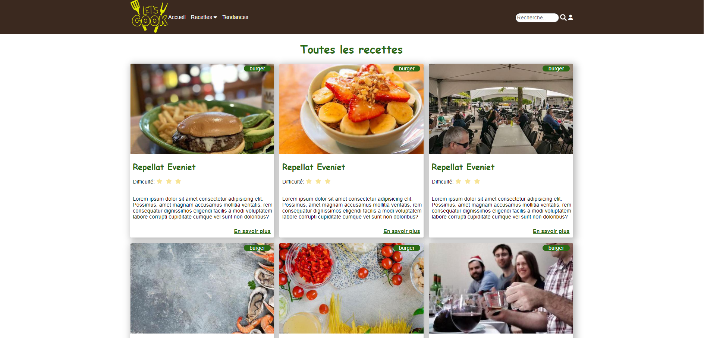
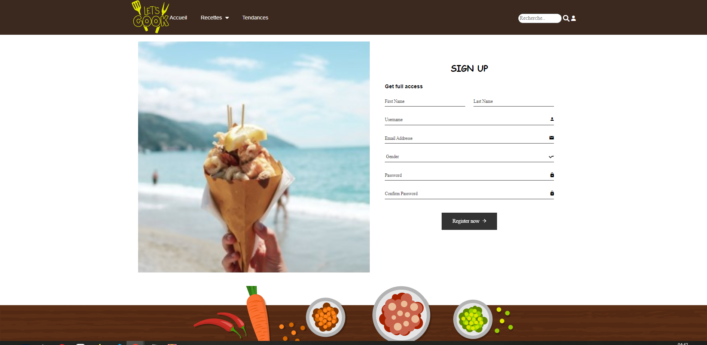

## HTML CSS

Bienvenue sur mon site de cuisine ! Ce projet a été développé dans le cadre de ma formation en HTML et CSS pour améliorer mes compétences en développement web.

### Aperçu du Site

Le site de cuisine est conçu pour fournir des recettes et des informations culinaires intéressantes. Il propose une interface utilisateur conviviale avec un design réactif pour s'adapter à différentes tailles d'écrans. Il y a également la présence d'un formulaire d'inscription.

### Contenu du Projet

#### Structure HTML

- **Header :** Le site dispose d'un en-tête avec un logo et une barre de navigation pour faciliter la navigation à travers les différentes sections.
  
- **Main :** La partie principale du site contient des articles présentant des recettes. Chaque article est structuré avec des images, des titres et du contenu textuel.

- **Footer :** Le pied de page contient des sections distinctes, y compris des informations de contact, des liens vers les réseaux sociaux, et un formulaire d'abonnement.

#### Styles CSS

- **Responsive Design :** Le CSS est optimisé pour un design réactif, assurant une expérience utilisateur agréable sur différents appareils.

- **Utilisation de Flexbox :** J'ai utilisé Flexbox pour organiser et aligner les éléments de manière efficace, notamment dans le header, le main, et le footer.

- **Effets Visuels :** Des effets visuels ont été ajoutés, tels que des filtres au survol des images pour créer une expérience interactive.

- **Media Queries :** Des media queries sont utilisées pour adapter le site à différentes résolutions d'écran, offrant une expérience cohérente sur tous les dispositifs.

#### Utilisation d'Images

- **Images Matricielles :** Certaines images, telles que les photos de recettes, sont en format matriciel pour garantir une haute qualité.

- **Images Vectorielles :** Des images vectorielles ont été utilisées pour des éléments graphiques, garantissant une netteté à toutes les tailles d'écrans.

### Comment Exécuter le Projet

1. Clonez le dépôt sur votre machine locale.
2. Ouvrez le fichier `index.html` dans votre navigateur web.

### Technologies Utilisées

- HTML5
- CSS3

### Remerciements

Un grand merci à NICOLAS MALET pour la qualité de la formation et les compétences acquises au cours de ce projet.

 <!-- ANCHOR __________________________________________________________________________________________Fichier de Renaud Mercier___________________________________________________________________________________  -->